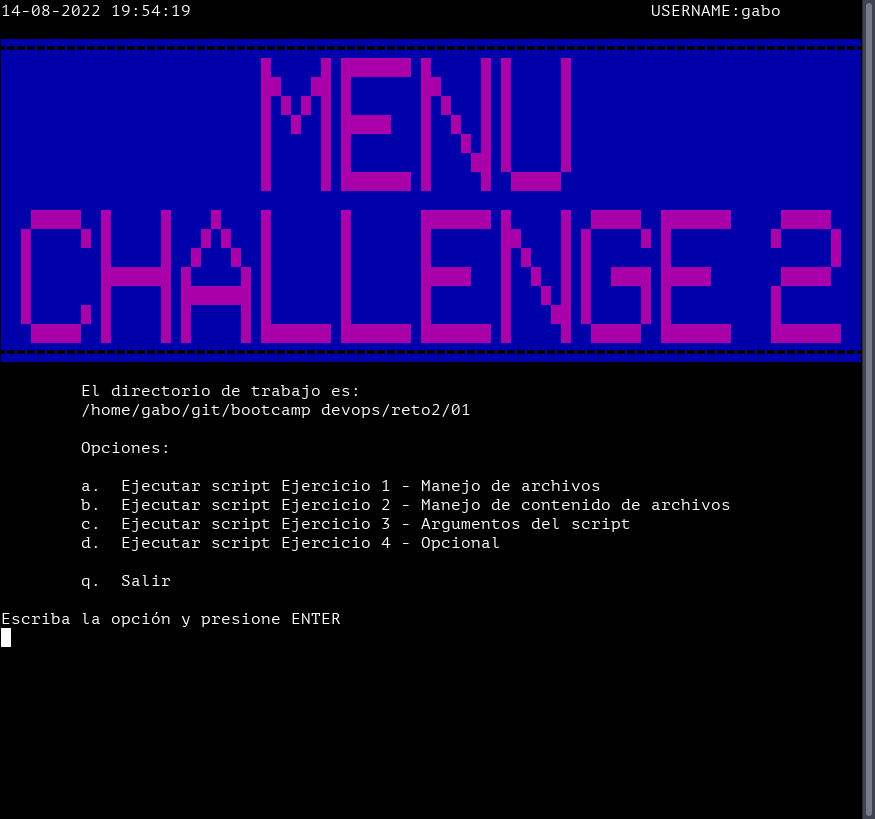
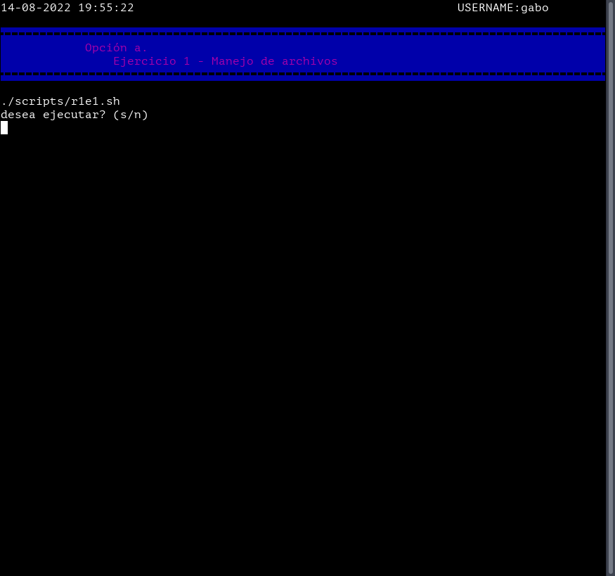
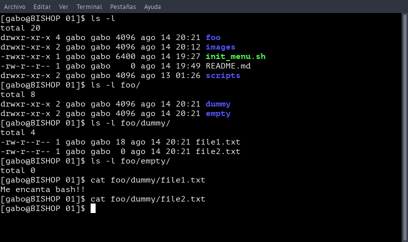
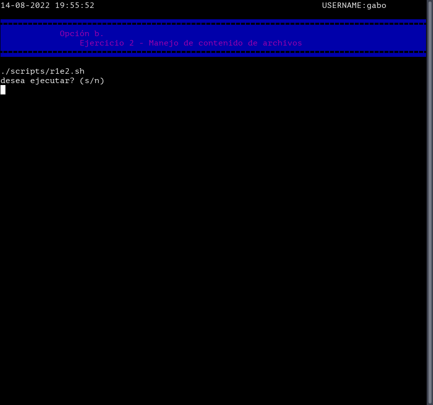
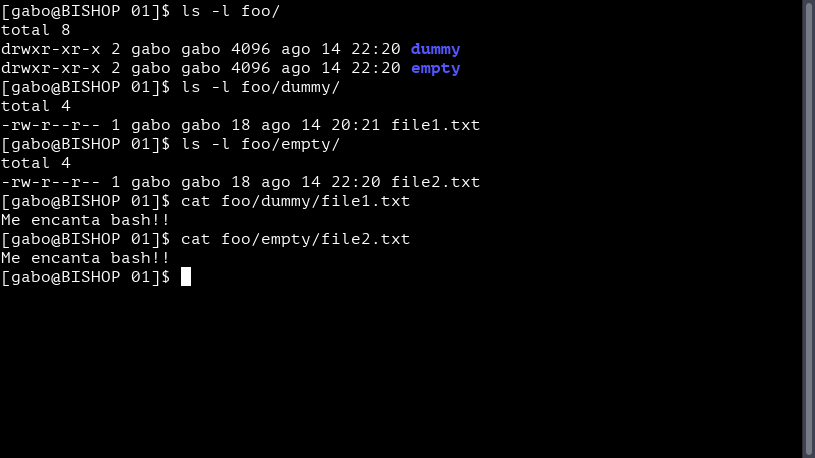
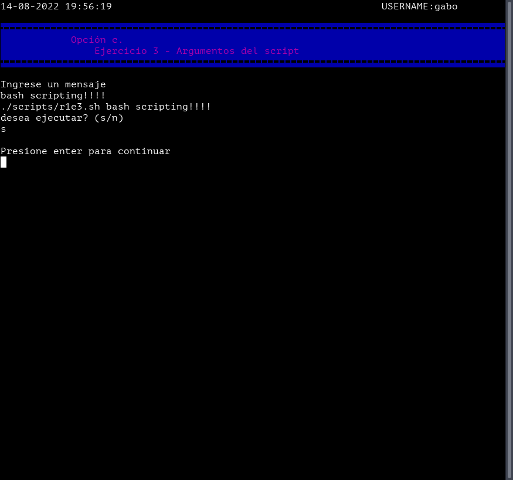
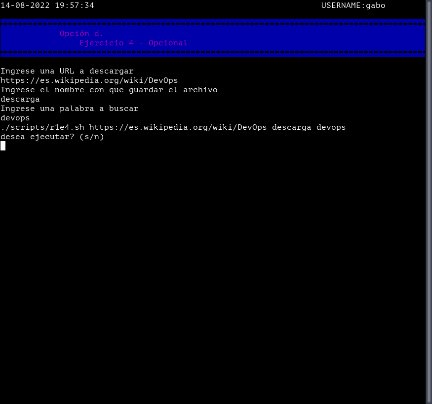

# __Reto 1 - Linux__

### __Introduccion__

Para resolver este reto se opto por realizar scripts individuales que 
resuelvan cada uno de los ejercicios y otro script que presente una 
interfaz de estilo menu que llame a dichos scripts.

A continuacion se muestra una imagen de este menu:

---

### __Ejercicio 1 - Manejo de archivos__

Seleccionando la __"opcion a"__ del menu se nos presenta la siguiente 
pantalla donde podemos decidir si si ejecutar el script correspondiente.

Si se ejecuta el script creara la siguiente jerarquia de directorios 
dentro del directorio donde se encuentra el script del menu.

---

### __Ejercicio 2 - Manejo de contenido de archivos__

Al elegir la __opcion b__ se nos muestra la siguiente pantalla: 

La cual nos permite ejecutar el script que dan solucion a este 
ejercicio. Para esto es necesario que antes se haya corrido el script 
del ejercicio 1.

Una vez ejecutado nos da la siguiente jerarquia:

---

### __Ejercicio 3 - Argumentos del script__

La __opcion c__ nos permite correr el script correspondiente al 
ejercicio 3. En este caso nos solicitara ingresar un __"mensaje"__ el 
cual sera pasado como parametro al escript _r1e3.sh_.

Y genera la siguiente salida:

---

### __Ejercicio 4 - Opcional__

Finalmente, la __opcion d__ nos permite ejecutar el script del ejercicio 
opcional. En esta oportunidad se nos pedira ingresar la __direccion__ de 
la cual queremos descargar un archivo, el __nombre__ con que lo 
guardaremos y la __palabra__ que queremos buscar en el contenido del 
archivo.

La salida del script sera una lista con los numeros de linea deonde se encuentra la __palabra__ buscada en el archivo.

